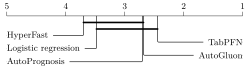

# TabMini

We introduce `TabMini`, the first tabular benchmark suite specifically for the low-data regime. Building on prior work ([Knauer et al., 2024](https://arxiv.org/abs/2409.01635)), `TabMini` includes additional curation steps to exclude datasets that are deprecated, derived from time series or images, outliers, ethically sensitive, or contain personally identifiable information. Our suite encompasses a diverse collection of [25 binary classification datasets](https://github.com/RicardoKnauer/TabMini/blob/master/tabmini/data/data_info.py) from 11 countries (predominantly the USA) and 9 domains (predominantly healthcare), and can be used to compare state-of-the-art machine learning methods, i.e., automated machine learning (AutoML) frameworks and off-the-shelf deep neural networks, against baselines such as logistic regression in the data-scarce setting.



### Installation/Development

This project was developed using a devcontainer, which is defined in the `.devcontainer` folder.

For development, a `requirements.txt` is included to be installed with pip.

To install the package as a Python package, you can use the following command:

```bash
pip install ./tabmini
```

#### Contributing

If you want to extend the baseline of the benchmark suite, see `/tabmini/estimators/__init__.py`.
By default, all estimators present in the `_ESTIMATORS` dictionary will be included in the benchmark suite.
You only need to implement `BaseEstimator`, `ClassifierMixin`, and add it to the dictionary.
(Or, adhering to the [scikit-learn API](https://scikit-learn.org/stable/developers/develop.html#rolling-your-own-estimator), you can ducktype as a classifier).

## Usage - Package

The `TabMini` benchmark suite is designed to be imported into your Python project, however, it can also be used as a
standalone package. The package is designed to be used in the following way:

```python
from pathlib import Path

from yourpackage import YourEstimator

import tabmini

# Load the dataset
# Tabmini also provides a dummy dataset for testing purposes, you can load it with tabmini.load_dummy_dataset() 
# If reduced is set to True, the dataset will exclude all the data that has been used to meta-train TabPFN
dataset = tabmini.load_dataset(reduced=False)

# Prepare the estimator you want to benchmark against the other estimators
estimator = YourEstimator()

# Perform the comparison
train_results, test_results = tabmini.compare(
    "MyEstimator",
    estimator,
    dataset,
    working_directory=Path.cwd() / "results",
    scoring_method="roc_auc",
    cv=3,
    time_limit=3600,
    device="cpu"
)

# Generate the meta-feature analysis
meta_features = tabmini.get_meta_feature_analysis(dataset, test_results, "MyEstimator", correlation_method="spearman")

# Save the results and meta-feature analysis to a CSV file
test_results.to_csv("results.csv")
meta_features.to_csv("meta_features.csv")
```

For more information on the available functions, including passing individual arguments to the estimators, 
see the function documentation in the `tabmini` module.

If you wish to selectively include or exclude estimators from the benchmark suite, you can do so by passing the
`methods` argument to the `compare` function. This argument should be a list of the estimators you wish to include.

```python
from tabmini.estimators import get_available_methods

# Please note that includes and excludes are case-sensitive
example_exclude = get_available_methods() - {"XGBoost", "CatBoost", "LightGBM"}
example_include = {"XGBoost", "CatBoost", "LightGBM"}

test_scores, train_scores = tabmini.compare(
    method_name,
    estimator,
    dataset,
    working_directory,
    scoring_method="roc_auc",
    cv=3,
    methods=example_exclude,  # type: ignore
    time_limit=3600,
    device="cpu",
    n_jobs=-1,
)
```

## Usage - Standalone

To run each framework in the benchmark suite within its own Docker container, execute the `orchestrate.py` script. Customize the `frameworks` and `time_limits` variables in the script to match your requirements.

### How It Works

The script will:
1. Build a separate Docker container for each framework.
2. Parallelize the execution of the processes.

### Output Structure

- Results for each framework will be saved in:  
  `workdir/EXP_{date}_{time}/{framework}/`  
  Each experiment will be stored in a separate file.

- At the end of the session, all results will be consolidated into:  
  `workdir/EXP_{date}_{time}/aggregated_results_{time_limit}.csv`

### Default Behavior

By default, the script runs the `example.py` script (detailed in the next section), which provides a demonstration of the `TabMini` benchmark suite. You can replace the example implementation (logistic regression) with your own estimator as needed.

## Example

For example usage, see `example.py`. This file is supposed to show how 
`TabMini` may be used. In the script, we demonstrate how to:

- Implement an estimator that is supposed to be compared to the other estimators (AutoGluon, AutoPrognosis, Hyperfast, TabPFN)
- Load the dataset
- Perform the comparison
- Save the results to a CSV file
- Load the results from a CSV file
- Perform a meta-feature analysis
- Save the meta-feature analysis to a CSV file.

`example.py` also contains the script that was used to generate the results in the paper.

## License

This project is licensed under the [MIT License](https://github.com/RicardoKnauer/TabMini/blob/master/LICENSE). See the `LICENSE` file for details.

## Authors

- Marvin Grimm (HTW Berlin)
- Ricardo Knauer (HTW Berlin)
- Abdelrahman Elsharkawi (HTW Berlin)
